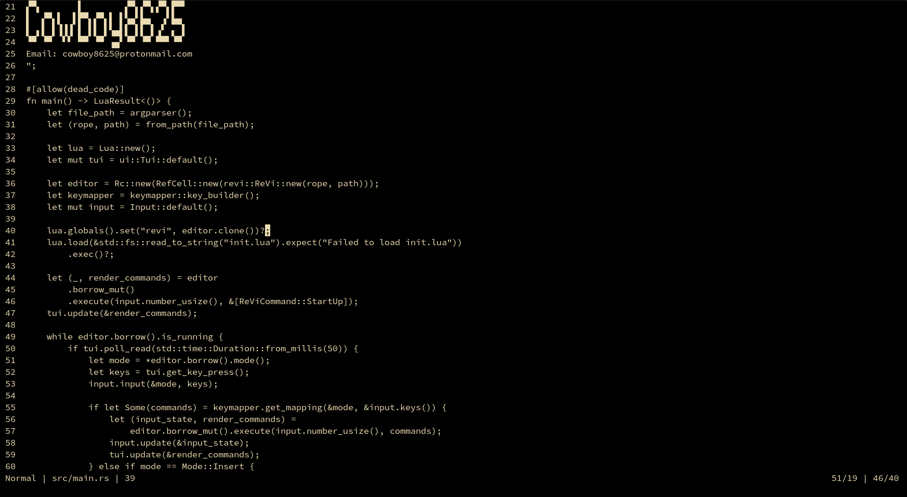

<h1 align="center"> ReVi </h1>
<p align="center">
<a></a>
<a></a>
<a href="https://crates.io/crates/revi"></a>
<a></a>
</p>
<p align="center">
<a></a>
<a></a>
<a></a>
<a></a>
</p>
<p align="center">
<a></a>
<a></a>
<a></a> <a href="https://discord.gg/KwnGX8P"></a>
<a></a>
</p>
<p align="center">
</p>

#  make state pointer to editor to pass to moding api


# Table Of Contents:

  - [**About**](#about)
  - [**Usage**](#usage)
  - [**Install**](#cratesio)
  - [**Clone && Installing**](#github)
  - [**Development**](#development-use)
  - [**Q&A**](#questions-and-answers)
  - [**KeyBindings**](#keybindings)
  - [**Roadmap**](#road-map)
- [**Changelog**](./CHANGELOG.md)

# About

  ReVi is a cross-platform terminal based Vim inspired text editor.
  Currently ReVi is in heavy development and it's probably not good idea to use for every day use
  but I have been using ReVi to work on ReVi to help find bugs. Editor inception 😲!
  If you like what you see help the project out with a [github](https://github.com/revi-editor/revi) star.
  If you find a bug please feel free to open a issues for it.

  <p align="center">
  <a></a>
  </p>


# Usage

### **Crates.io**
  ```sh
  cargo install revi --version="0.0.0-beta-2"
  revi <filename>
  ```
### **GitHub**
  ```sh
  cargo install --git https://github.com/revi-editor/revi
  revi <filename>
  ```

### **Development Use**
  ```sh
  git clone https://github.com/revi-editor/revi
  cd revi
  cargo run --release -- <filename>
  ```

### **Questions and Answers**

  - *ReVi is locked up* => Press `Esc` and then do command to clear command chase.  WIP.
  - *ReVi doesn't even open* => for version's `0.0.0-beta-0.5` and below need to have a `init.lua` file in the directory.  FIXED on version `0.0.0-beta-0.6`

# KeyBindings

### **Normal Mode**

  |'Key'|*Command*|Note
  |:---|:---:|---:
  <kbd>Esc</kbd>|*NormalMode*|
  <kbd>ZZ</kbd>|*Save Quit*|
  <kbd>ZQ</kbd>|*Quit*|
  <kbd>p</kbd>|*Paste Below Cursor*|
  <kbd>P</kbd>|*Paste Above Cursor*|
  <<kbd>C</kbd>-<kbd>y</kbd>>|*ScrollUp Cursor Keeps Line Number*|Not working 100% correct
  <<kbd>C</kbd>-<kbd>e</kbd>>|*ScrollDown Cursor Keeps Line Number*|Not working 100% correct
  <<kbd>C</kbd>-<kbd>u</kbd>>|*ScrollUp*|Not working 100% correct
  <<kbd>C</kbd>-<kbd>d</kbd>>|*ScrollDown*|Not working 100% correct
  <kbd>j</kbd>|*CursorDown*|
  <kbd>Down</kbd>|*CursorDown*|
  <kbd>k</kbd>|*CursorUp*|
  <kbd>Up</kbd>|*CursorUp*|
  <kbd>h</kbd>|*CursorLeft*|
  <kbd>Left</kbd>|*CursorLeft*|
  <kbd>l</kbd>|*CursorRight*|
  <kbd>Right</kbd>|*CursorRight*|
  <kbd>w</kbd>|*Move Forwards by a Word*|
  <kbd>b</kbd>|*Move Backwards by a Word*|
  <kbd>:</kbd>|*CommandMode*|
  <kbd>i</kbd>|*InsertMode*|
  <kbd>x</kbd>|*DeleteChar*|
  <kbd>Delete</kbd>|*DeleteChar*|
  <kbd>d</kbd>|*DeleteLine*|
  <kbd>Home</kbd>|*Home*|
  <kbd>End</kbd>|*End*|
  <kbd>0<kbd>|*Home*|
  <kbd>$<kbd>|*End*|
  <kbd>A</kbd>|*End InsertMode CursorLeft*|
  <kbd>gg</kbd>|*JumpToFirstLine*
  <kbd>G</kbd>|*JumpToLastLine*
  <kbd>u</kbd>|*Undo*

### **Insert Mode**

  |'Key'|*Command*|Note
  |:---|:---:|---:
  <kbd>Esc</kbd>|*Normal*|
  <kbd>Backspace</kbd>|*Backspace*|
  <kbd>Enter</kbd>|*NewLine*|
  <kbd>Home</kbd>|*Home*|
  <kbd>End</kbd>|*End*|
  <kbd>Down</kbd>|*CursorDown*|
  <kbd>Up</kbd>|*CursorUp*|
  <kbd>Left</kbd>|*CursorLeft*|
  <kbd>Right</kbd>|*CursorRight*|

### **Command Mode**

  |'Key'|*Command*|Note
  |:---|:---:|---:
  <kbd>Esc</kbd>|*Normal*|
  <kbd>Enter</kdb>|*Normal*|

### **Commands**
  *All Commands will change in further versions*
  |'Command'|*Action*|Note
  |:---|:---:|---:
  `q`|*QUIT*|
  `quit`|*QUIT*|
  `qw`|*SAVE QUIT*|
  `exit`|*QUIT*|
  `[number]`|*Goto LineNumber*
  `e[filename]`|*Opens or Creates a new file and swaps window*|
  `b[buffer number]`|*Sets Buffer*|
  `set number`|*Sets line numbers to AbsoluteNumber*|
  `set relativenumber`|*Sets line numbers to RelativeNumber*|
  `set nonumber`|*Removes any line number type*|

# Road Map

### **Added Modes**:
  - [X] **Normal**
  - [X] **Insert**
  - [X] **Command**
  - [ ] **Visual**
  - [ ] **Visual Line**
  - [ ] **Visual Block**

### **KeyBindings**
  - [X] **Basic KeyBindings**

### **Plugin Support**
  - [ ] **Plugin API**:
  - [ ] **Custom KeyBindings**
  - [ ] **Help Docs**

### **WebSite**
  - [ ] **WebSite**
  - [ ] **Package Manager**

### **Other**
  - [ ] **Basic Unicode Support**
  - [ ] **LSP**
